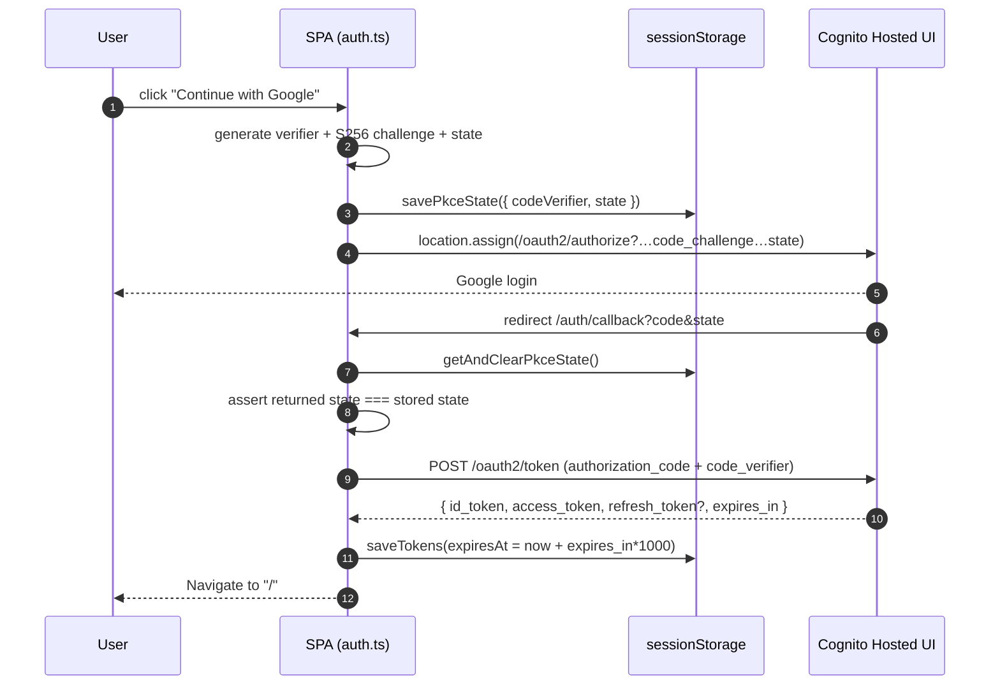
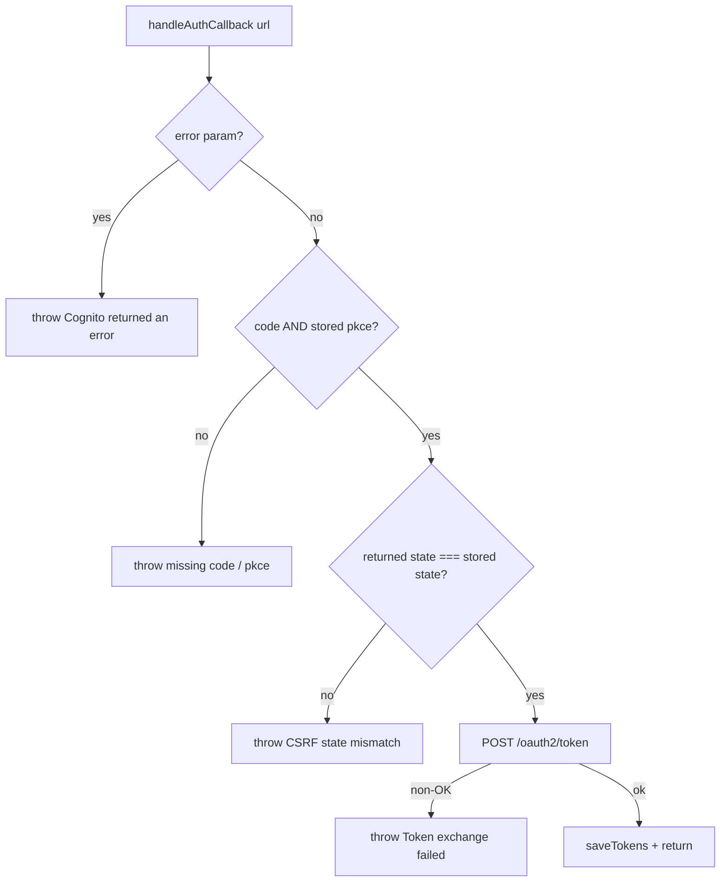
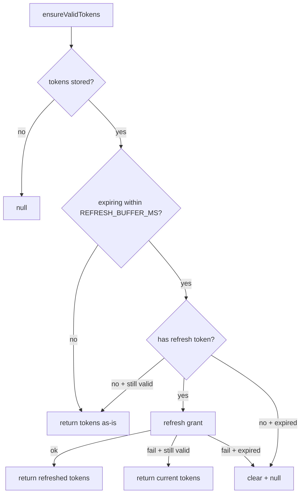

# Diagrams — Frontend Auth Module

## PKCE sign-in (swimlane)

```mermaid
sequenceDiagram
    autonumber
    participant U as User
    participant App as SPA (auth.ts)
    participant SS as sessionStorage
    participant Cog as Cognito Hosted UI

    U->>App: click "Continue with Google"
    App->>App: generate verifier + S256 challenge + state
    App->>SS: savePkceState({ codeVerifier, state })
    App->>Cog: location.assign(/oauth2/authorize?…code_challenge…state)
    Cog-->>U: Google login
    Cog->>App: redirect /auth/callback?code&state
    App->>SS: getAndClearPkceState()
    App->>App: assert returned state === stored state
    App->>Cog: POST /oauth2/token (authorization_code + code_verifier)
    Cog-->>App: { id_token, access_token, refresh_token?, expires_in }
    App->>SS: saveTokens(expiresAt = now + expires_in*1000)
    App-->>U: Navigate to "/"
```

## Callback decision

```mermaid
flowchart TD
    A[handleAuthCallback url] --> B{error param?}
    B -->|yes| E1[throw Cognito returned an error]
    B -->|no| C{code AND stored pkce?}
    C -->|no| E2[throw missing code / pkce]
    C -->|yes| D{returned state === stored state?}
    D -->|no| E3[throw CSRF state mismatch]
    D -->|yes| F[POST /oauth2/token]
    F -->|non-OK| E4[throw Token exchange failed]
    F -->|ok| G[saveTokens + return]
```

## Session validity (ensureValidTokens)

```mermaid
flowchart TD
    A[ensureValidTokens] --> B{tokens stored?}
    B -->|no| N[null]
    B -->|yes| C{expiring within REFRESH_BUFFER_MS?}
    C -->|no| K[return tokens as-is]
    C -->|yes| D{has refresh token?}
    D -->|yes| R[refresh grant]
    R -->|ok| K2[return refreshed tokens]
    R -->|fail + still valid| K3[return current tokens]
    R -->|fail + expired| Z[clear + null]
    D -->|no + still valid| K
    D -->|no + expired| Z
```
